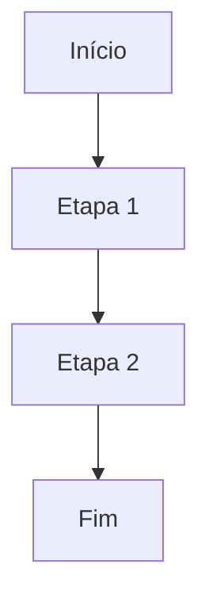
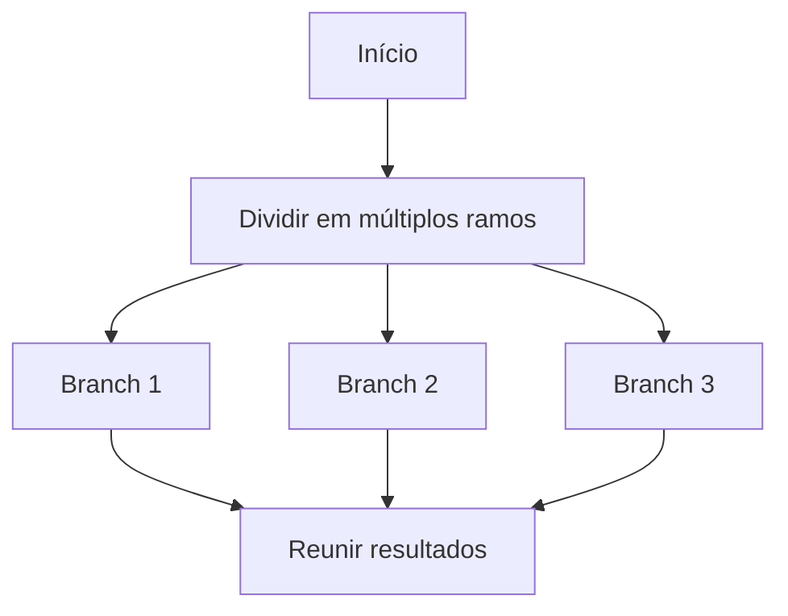
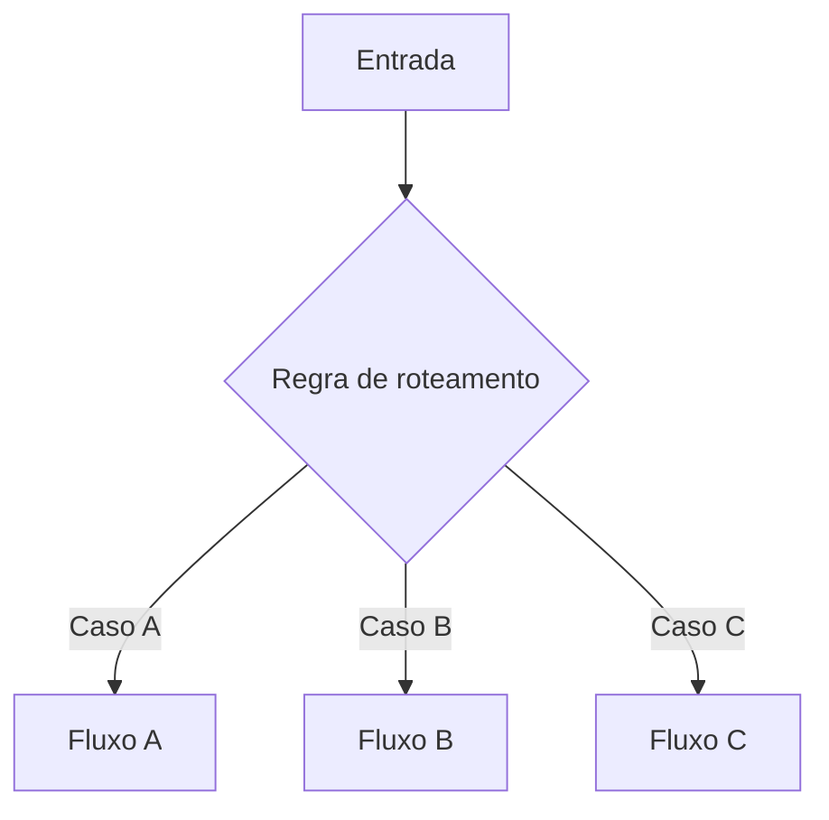
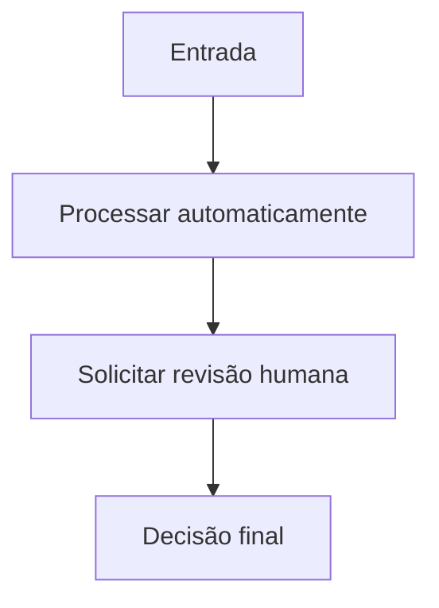
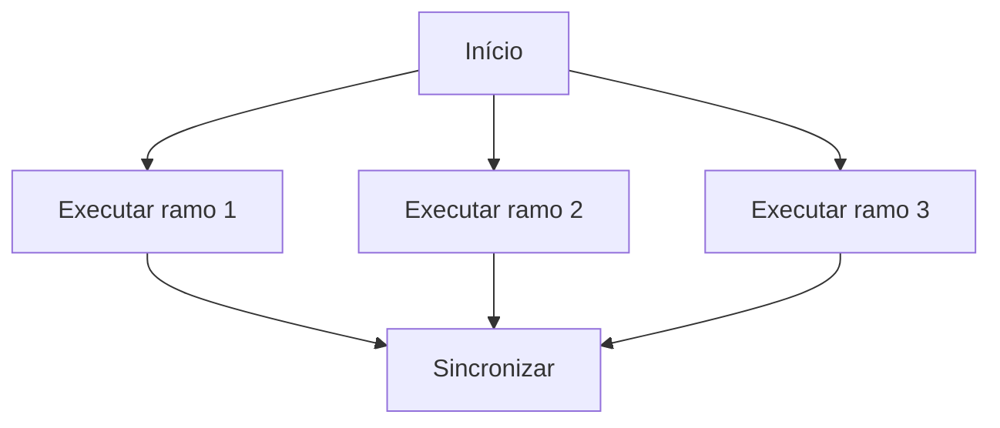
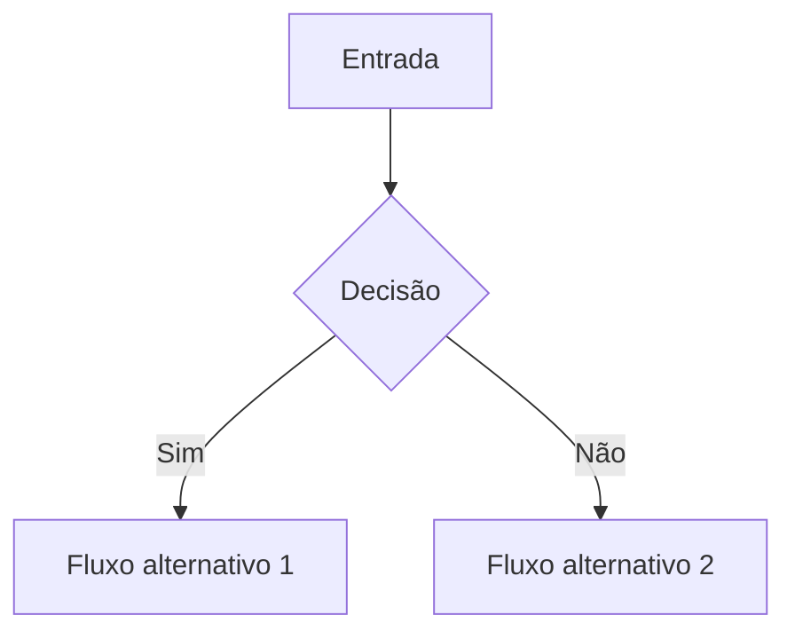

# workflow-patterns-lang

Projeto para demonstrar seis padrões de workflow inspirados em LangGraph com uma CLI simples para execução e geração de relatório de análise.

## Como usar

```bash
python3 -m workflow_patterns_lang.cli run --pattern all --output results.json --threshold 0.8
python3 -m workflow_patterns_lang.cli report --output analysis.md --threshold 0.8 --tradeoff latency
```

## Padrões implementados

### 1. Sequential



- Quando usar: quando a lógica depende de uma ordem fixa e cada passo precisa acontecer após o anterior.
- Quando não usar: se houver muitas etapas independentes, pois isso aumenta o tempo total e reduz a paralelização.

### 2. Fanout



- Quando usar: quando uma tarefa pode ser executada em vários caminhos simultâneos e os resultados precisam ser agregados depois.
- Quando não usar: se os ramos forem muito caros, dependerem fortemente um do outro ou gerarem excesso de latência e custo.

### 3. Routing



- Quando usar: quando há regras claras para direcionar a tarefa para diferentes caminhos.
- Quando não usar: se as regras forem ambíguas, mudarem com frequência ou dependerem de contexto fraco demais para justificar a decisão.

### 4. Human



- Quando usar: para cenários sensíveis, de alto risco, com impacto regulatório ou quando a confiança do modelo é insuficiente.
- Quando não usar: em fluxos de baixa criticidade, onde a latência e o custo humano seriam desproporcionais.

### 5. Parallel



- Quando usar: quando os subfluxos são independentes e podem ser executados ao mesmo tempo para ganhar throughput.
- Quando não usar: se houver dependência entre os ramos ou se a sincronização for mais cara do que o ganho de performance.

### 6. Branching



- Quando usar: quando há um ponto de decisão claro e você quer explorar caminhos alternativos com base em contexto.
- Quando não usar: se a decisão for irrelevante, muito instável ou se os caminhos alternativos não agregarem valor real ao resultado.

## Observações de análise

- O projeto avalia cada workflow com métricas de confiança, latência, custo e risco.
- O threshold pode ser ajustado para decidir se um padrão atende ao nível mínimo desejado.
- O tradeoff pode ser analisado com foco em latência, custo ou precisão, dependendo do cenário.

